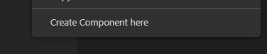
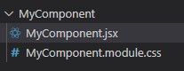
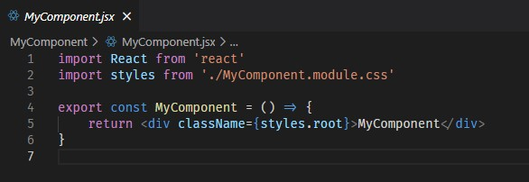

# Create React Component

Extension helps creating React components

## Features

Context menu item in explorer on folders:

Enter component name:

Creates folder with items:

Files with content:

## Extension Settings

This extension contributes the following settings:

%name% will be replaced with component name.

* `create-react-component.cssFileName`: Name of generated css file.
* `create-react-component.jsxFileName`: Name of generated css file.
* `create-react-component.jsxComponentContent`: Content of generated jsx file.
* `create-react-component.cssComponentContent`: Content of generated css file.
